# IBM Datapower Interact Gateway Demo - Step by Step Deployment Guide

## Overview

This guide walks through on how to deploy and connect all the requiered components to deliver a Datapower Interact Gateway Demo. The architecture has the following components: Computer Parts API and Demo UI deployed on Red Hat OpenShift, IBM DataPower Interact Gateway and Watsonx Orchestrate.

The architecture is divided into four key components, each serving a specific role. To make this easier to follow, this guide is broken into four sections, with each section focusing on one component of the system.

## End-to-End Architecture (High Level Explanation)

The diagram below represents the full system being built in this guide. At a high level, the architecture consists of four main components, each responsible for a specific role. This architecture shows how an AI agent can safely access enterprise systems through a controlled integration layer. Understanding how these components interact makes the deployment process easier to follow.

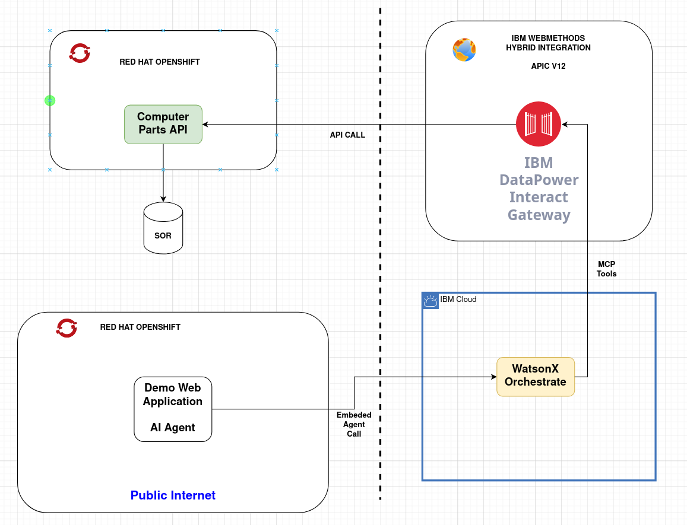
*Figure 1: Full System View*

### 1. Red Hat OpenShift (Backend API Layer)

- Hosts the Computer Parts API
- Runs as a pre-built container image (packaged application)
- Acts as the system of record

In simple terms, this is the component where the actual data and business logic live. The API provides endpoints such as customers, orders, and products. All the data is dynamically generated, which makes it ideal for demos and testing.

### 2. API Connect & DataPower Interact Gateway (MCP Integration Layer)

- Sits between the backend API and consumers
- Acts as an API gateway (MCP Server)
- Controls how APIs are exposed and accessed

In simple terms, this is where we create a secure "middle layer" that manages and routes the API calls that get made. Instead of calling the API directly, all requests go through DataPower Interact Gateway, which handles routing, applies policies, and exposes APIs as tools, specifically MCP (Model Context Protocol) tools.

### 3. Watsonx Orchestrate (AI Orchestration Layer)

- Hosts an AI agent
- Decides which API to call based on user input
- Uses the APIs exposed by DataPower Interact Gateway

In simple terms, this is the actual brain that understands user requirements and decides what to then do. For example, if the user asks to get customer 10001A, Watsonx Orchestrate will interpret the request, call the correct API, and return the formatted results.

### 4. Demo Web Application (User Interface Layer)

- A simple web interface exposed over the internet
- Runs as a pre-built container image (packaged application)
- Contains the embedded Watsonx Orchestrate AI agent

In simple terms, this is what the user will actually interact with.

To make this guide even easier to understand, it is broken up into four main sections, representing the four components of this architecture. There is also a Section 0, which includes everything needed to get started, but it can be skipped if you are familiar with TechZone and already have a cloud account.

---

## Section 0 — Getting Started

To get started, you need to request the environment from TechZone. Go to this [link](https://techzone.ibm.com/collection/69c6c2db1bdc18e8109d08ed) in Techzone to reserve your Openshift Cluster. This environment will be used in for Section 1 and 4. Go through the necessary steps to get access to the environment, and make sure you have an opportunity ready and available to use. You must also have an IBM cloud account.

Now, for Section 2, get access to the **webMethods Hybrid Integration** platform. To get acccess to the correct one, join the #iwhi-internal-shareholders channel in Slack, go to Workflows, and submit the request titled "Americas IWHI Subscription Access." Approval typically takes 1-2 business days. Once approved, the environment will appear in your dropdown.This platform uses API Connect and DataPower to place the backend API behind a gateway that controls, routes, and manages how it is accessed by external systems.

Finally, you must create/open your [cloud account](https://cloud.ibm.com/resources) to use Watsonx Orchestrate. Watsonx Orchestrate is used in Section 3 to create an AI agent that understands natural language and dynamically calls the API to retrieve and return the data.

Once you gain access to all three of these environments from TechZone, you will have all of the resources necessary to complete this demo.

---

## Section 1 — Red Hat OpenShift

In this first section, we will focus only on the foundation of the architecture:

1. Deploy the API into OpenShift
2. Make it accessible via a public URL
3. Validate that it returns data

We start here because the OpenShift API is the core dependency for everything else. It is the backend of the entire system we are creating, and without a working backend the rest of the system can't even be created. At the end of this section, you will have a running API inside OpenShift, a public URL, a working API that returns JSON data, and a backend ready for the rest of the architecture.

### 1. Accessing the OpenShift Cluster

First, go into your TechZone environment and locate **OpenShift Cluster OCPv IBM Cloud**. Click the arrow to the left of the name in order to expand the environment details. After that, click the link that is under **OCP console**. Log in using `kubeadmin` as the username, and the password that TechZone gives you. Once you do that, switch to **Developer view**.

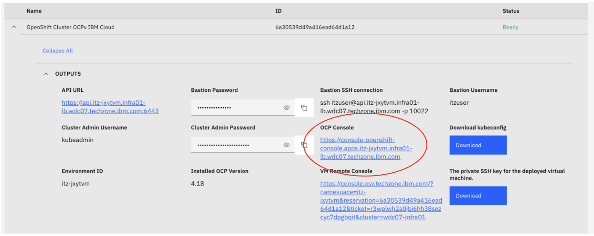
*Figure 1: OCP Console Link*

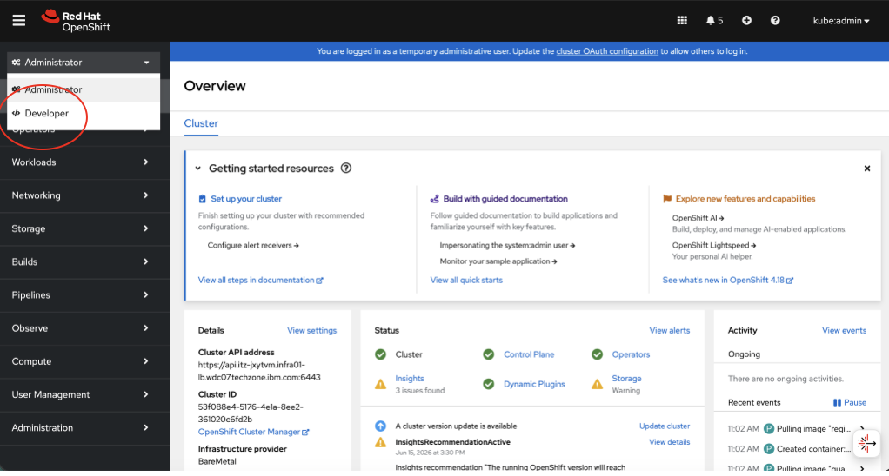
*Figure 2: Dropdown Switching*

### 2. Create a Project (Workspace)

For this part, we will have to actually create a project.

Create a project (**Add → Create Project**) and name it `fxnpc`.

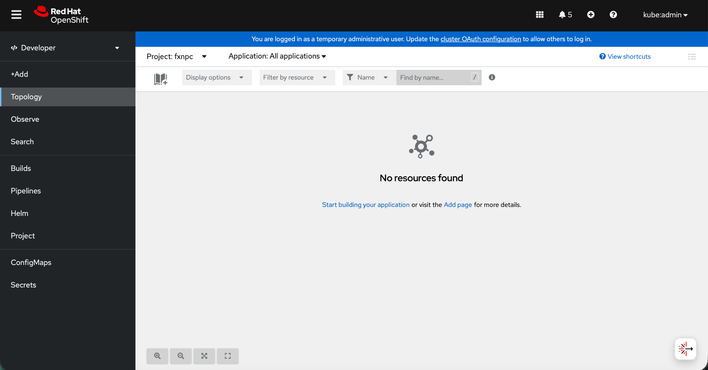
*Figure 3: Correct Project Screen*

### 3. Deploy the API using YAML

Use this [Deployment YAML file](https://raw.githubusercontent.com/anshparikh06/Computer-Parts-API/refs/heads/main/deployment.yaml) to create the required objects in the OpenShift cluster. From the previous screen, follow the next steps.

Import the YAML file (**+Add → Import YAML**), replace the contents, and click **Create**.

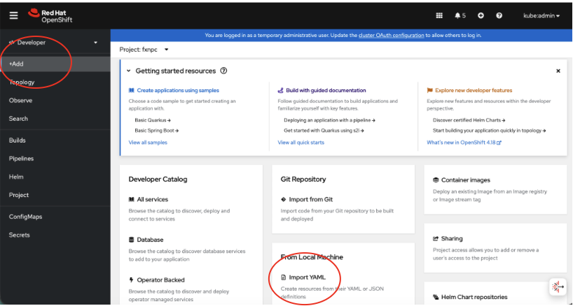

*Figure 4: Correct Buttons to click*

### 4. View Your Application

To view your application, go to **Topology**, then you will see `computer-parts-api`. You should see a circle with your app name and a blue ring around it.

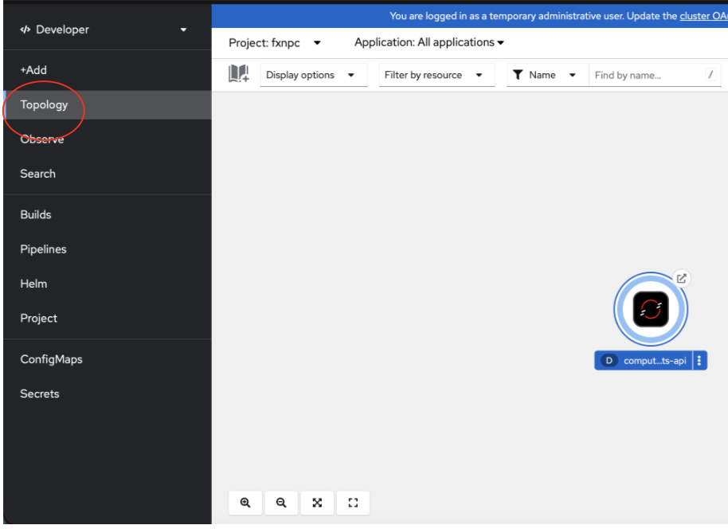

*Figure 5: Correct button to view Topology*

### 5. Check POD Status (VERY IMPORTANT)

This is where common mistakes happen, so be careful. First, click on your application circle, and look at the right side panel. Find where it says **PODS**. In that section, the PODS should not be stuck in pending, as they are below and as they will likely show up for you. If your pods are running, click the link and skip to Section 2. Otherwise, keep following Section 1.

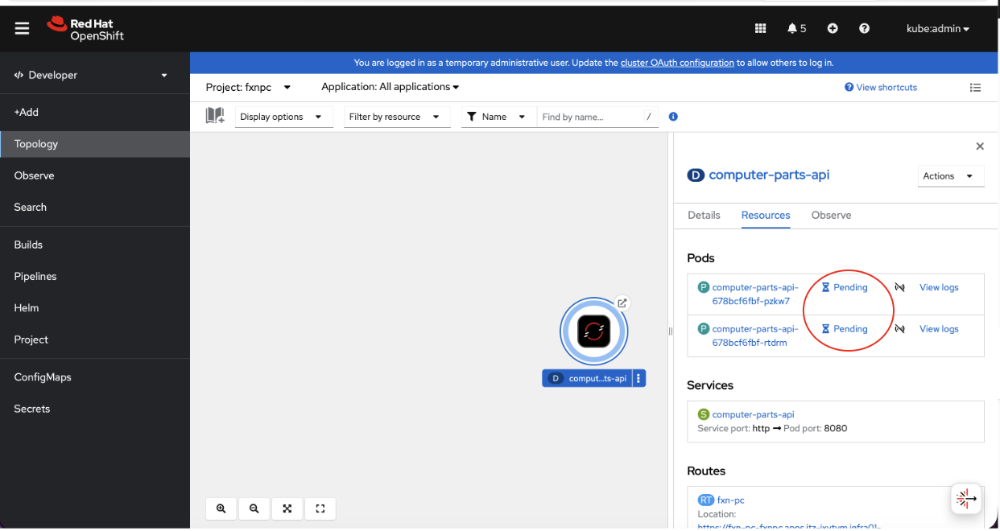
*Figure 5: Incorrect View*

The PODs can get stuck in pending because the system is asking for too many resources.

1. **Reduce the POD count.** Click the three dots, then select what is circled below. Switch the number of pods from 2 to 1, then click **Save**.

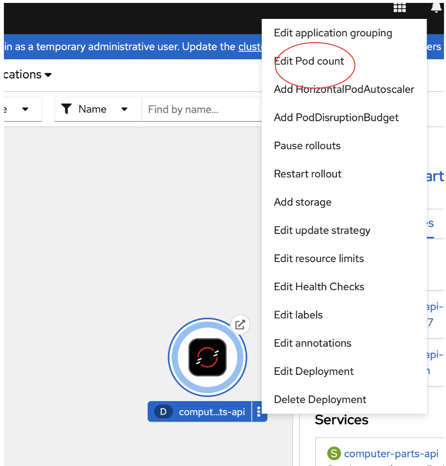

*Figure 6: Edit Pod Count*

2. **Now, reduce the resource limits.** Click the three dots again and click what is circled below. Set CPU Request to `100m` and CPU Limit to `250m`. Ensure values are entered in millicores (for example, `100m` = 0.1 CPU). Next, set Memory Request to `256Mi` and Memory Limit to `512Mi`. Save your changes.

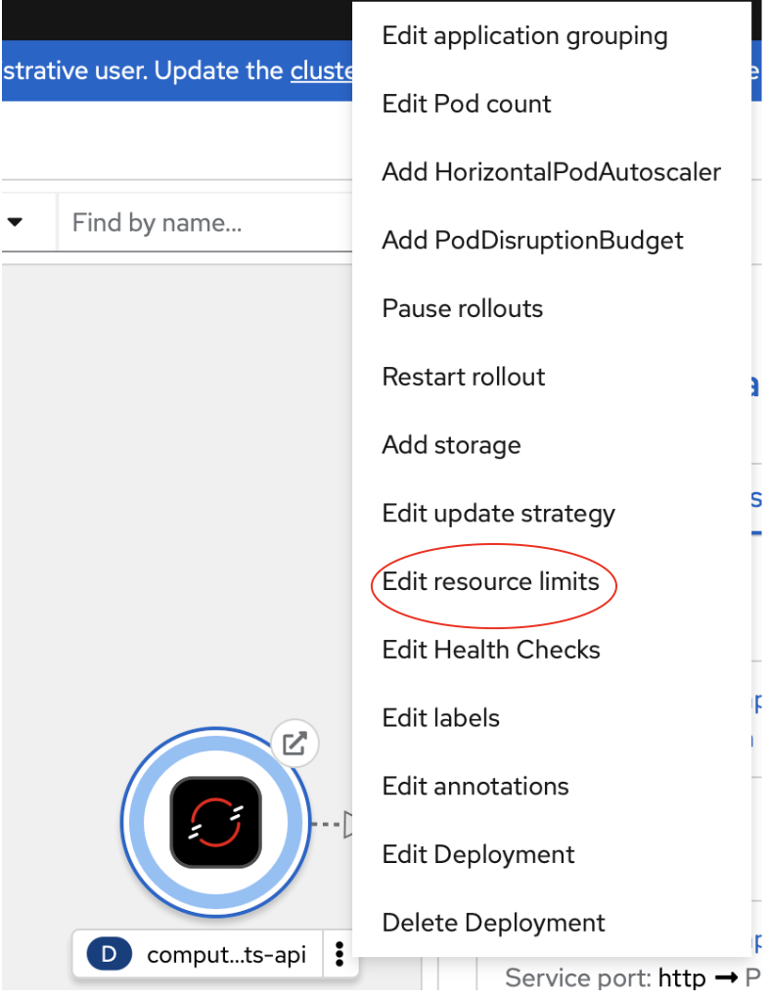

*Figure 7: Edit Resource Limits*

3. Now that all of these changes have been made, you need to **restart rollout** in order to fully apply them. Once again, click the three dots and click the button circled below. The PODs should now be running.

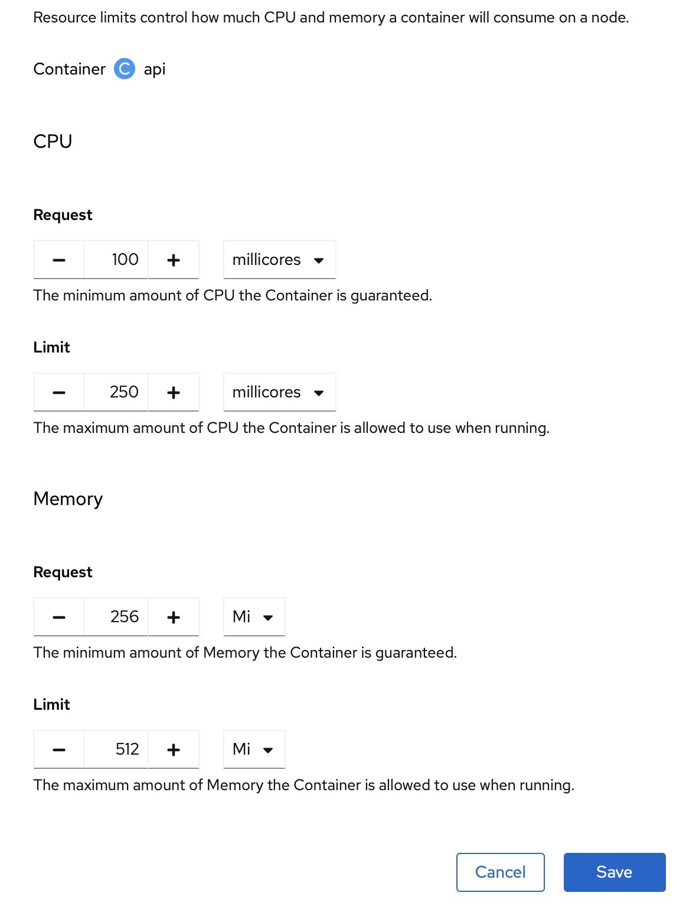
*Figure 8: Restart Rollout*

### 6. Access the Application (Route)

Now that we have the correct configuration, click your app in **Topology**. Look for **Routes** and click on the link that is circled below. A new browser tab will then open with your application.

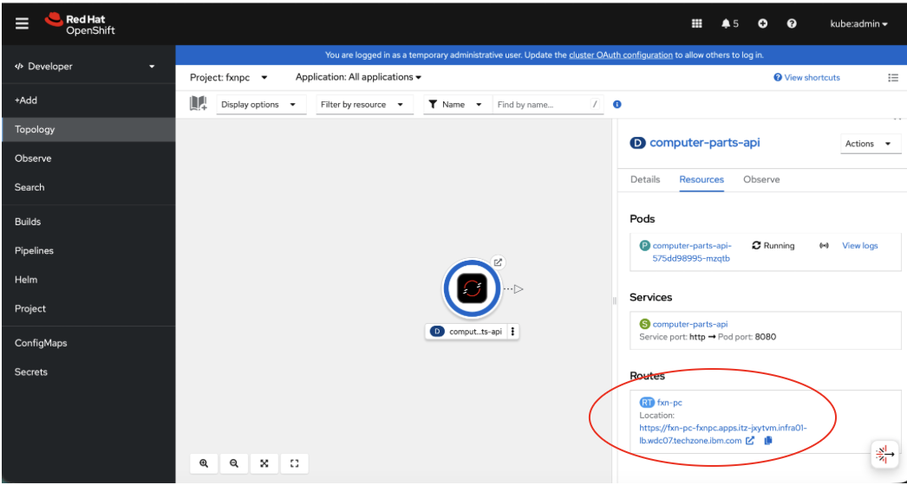
*Figure 9: Correct route to click*

This entire Computer Parts Store API should load and you should see Swagger UI, where you can test API endpoints. Without a Route, the application would only be accessible inside OpenShift and could not be opened in a web browser.

### Section 1 Conclusion

Once you've followed all of these steps, your PODs should be running, the route URL should work, the Swagger UI should load, and the API returns JSON. You have now successfully deployed a containerized API to OpenShift, made it accessible via a public URL, and verified that it works. This matters because the API is the foundation of your architecture — everything will depend on it: DataPower will call it, and Watsonx Orchestrate will retrieve data from it. You have now successfully completed the following part of our overall architecture.

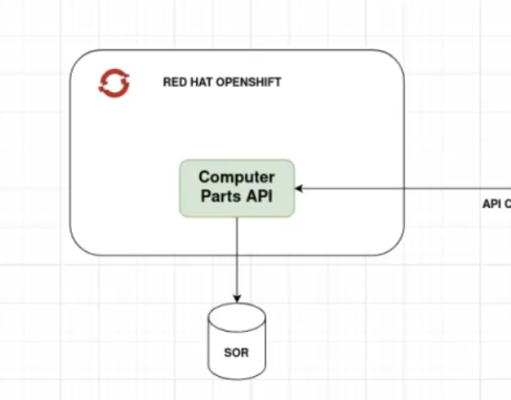

*Figure 10: Congrats! Section 1 is complete*

---

## Section 2 — IBM DataPower (Integration Layer)

In this section, you will place your OpenShift API behind an enterprise API gateway using IBM API Connect and DataPower. More importantly, you will transform your traditional REST API into a set of AI-ready tools using **MCP (Model Context Protocol)**. This is what allows Watsonx Orchestrate to call your API intelligently in Section 3.

> **Note:** If the requested environment doesn't work for you, you will have to use links from **Americas v12**, which you should get an email for after requesting access. The same applies to Section 3.

By the end of this section you will have:

- A fully configured API gateway protecting your backend
- Your API published as discoverable MCP tools
- A Gateway Endpoint URL for connecting Watsonx Orchestrate

**Why do this?** In real enterprise systems, APIs are never exposed directly to the public or to AI systems. Instead, they are placed behind a gateway that controls who can access them, enforces security policies, and manages traffic. IBM DataPower provides all of this.

### 1. Access the API Connect Environment

The best way to do this is to request access to what was mentioned in section 0 and click the link that will get emailed to you. The other way is to go into your TechZone environment and locate **webMethods Hybrid Integration L4 Platform Enablement**. Expand the environment and locate the **API Connect / API Studio** link, and click it to open the API Connect interface.

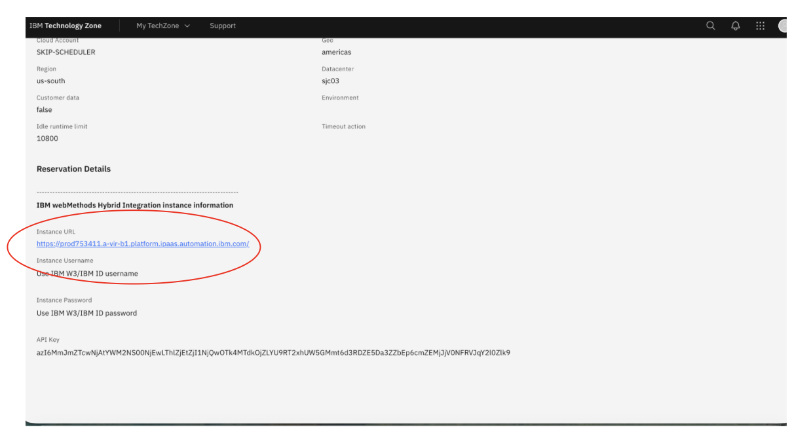
*Figure 1: Correct Link to Select/Welcome Screen*

### 2. Create a New API Project

Once you are inside API Connect, you must create a project to organize your API. Click **Create → New API Project**. Then select **Create blank project**. The project name can be anything, but to keep things simple, name it `computer-parts-api`. Then click **Create**.

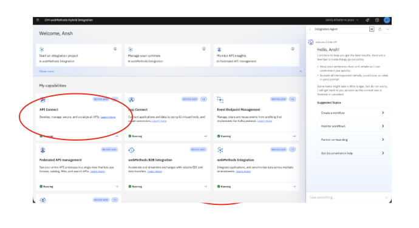

*Figure 2: Create → New API Project → Create Blank Project → Name → Create*

### 3. Set Up the Correct Environment

After creating your project, click into it. Before proceeding, confirm two things about your view:

- You are in **AI View** — check the dropdown in the top right corner of the screen and switch to "AI View" if needed.
- Your environment is set to **Americas_Dev_v12** — check the environment selector in the top-right corner.

If you do not see Americas_Dev_v12 as an option, you need to request access to it. Join the `#iwhi-internal-shareholders` channel in Slack, go to **Workflows**, and submit the request titled **"Americas IWHI Subscription Access."** Approval typically takes 1–2 business days. Once approved, the environment will appear in your dropdown.

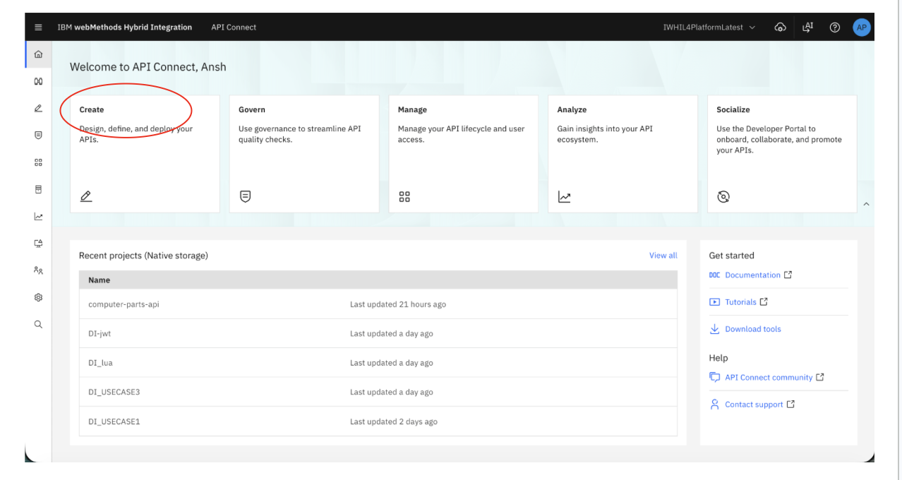
*Figure 3: Correct View — AI View Selected, Americas_Dev_v12 Environment*

### 4. Create the MCP Server

Now you will generate MCP tools from your OpenShift API. MCP (Model Context Protocol) is a standard that allows AI systems to discover and use tools. By converting your API to MCP tools, you are giving Watsonx Orchestrate a structured, AI-readable description of everything your API can do.

Follow these steps:

1. Click **Generate MCP Tools** from the Quick Start panel.
2. Select **Generate from REST API → Next → From External**.
3. You will be prompted to upload an API definition file. To create this file: open a code editor (such as VS Code), create a new file named `computer-parts-api.json`, paste in the full OpenAPI specification from your Swagger UI (the JSON output from your OpenShift API), and save the file.
4. Upload the file by dragging it into the upload area or clicking to browse.
5. Click **Next → select all available API operations → click Generate**.

API Connect will now create an MCP server definition that includes all of your API's endpoints as individual tools, each with a name, description, and parameter list that an AI agent can interpret.

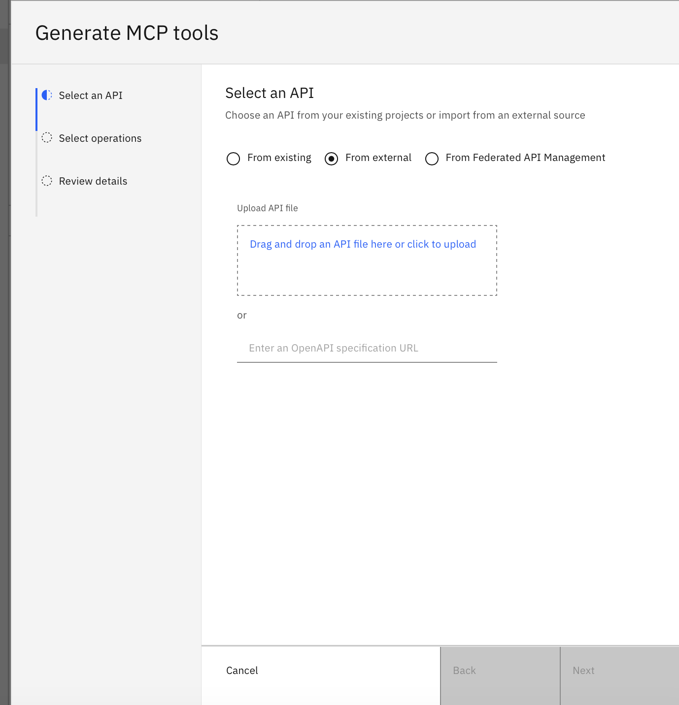
*Figure 4: Uploading the API Definition File*

### 5. Publish and Get Your Gateway Endpoint

Your MCP server is configured. Now you will publish it so it is accessible through the DataPower gateway. **Important: Make sure you are still in AI View before proceeding.**

1. Click **Publish** in the top right corner.
2. For the catalog, select anything (the example uses `SophieTest`).
3. Apply the default settings and click **Next → Publish**.
4. When you see "Publish Successful" in the top right corner, click **Catalog** to navigate to the catalog view.
5. Click the three-dot menu next to your published API and select **View Endpoints**.
6. Copy the **Gateway Endpoint URL** that appears. You will need this URL in Section 3.

When you have the Gateway Endpoint URL, Section 2 is complete.

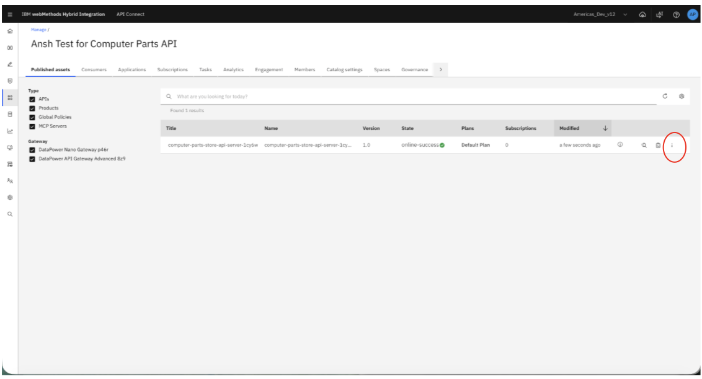
*Figure 5a: Viewing Endpoints After Successful Publish*

### Section 2 Complete

Your backend API has been transformed into an AI-ready interface. Instead of exposing raw REST endpoints, it is now represented as a structured set of MCP tools that AI agents can discover and use. You have moved from a traditional API-centric architecture to the beginning of an AI-native integration model.

---

## Section 3 — Watsonx Orchestrate (AI Orchestration Layer)

In this section, we will focus on the final core component of the architecture: the AI orchestration layer. Specifically, we will:

1. Create an AI agent
2. Connect the agent to the MCP server using the Gateway Endpoint URL generated in Section 2
3. Enable natural language interaction
4. Test the full system

We complete this step because it transforms our system from a traditional API setup into an intelligent system that can understand user requests and automatically call the correct API. At the end of this section, you will have a fully functional AI agent that can interpret natural language and return real data from your API.

### 1. Access Watsonx Orchestrate

From your [cloud account](https://cloud.ibm.com/resources), search for "WatsonX Orchestrate" in the search bar. For location, pick whichever server is closest to you. **Start a trial->Read and agree to the terms->Create->Launch WatsonX orchestrate**. You should land on the Watsonx Orchestrate welcome page.

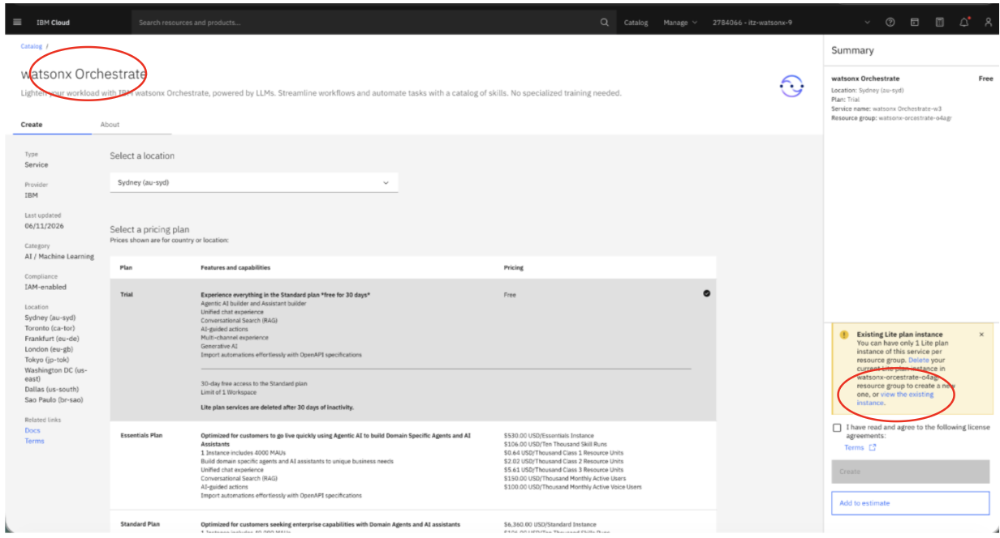
*Figure 1: Accessing WatsonX Orchestrate*

### 2. Creating an Agent

Now that you are inside Watsonx Orchestrate, the next step is to create your AI agent. Locate the agent builder and click **Create an agent**. Then click **Create from scratch**. You will now be prompted to configure your agent. For name, enter `computer parts agent`, and for description, write "retrieves customer data from the Computer Parts API." This step creates the AI agent itself. At this point, the agent is simply capable of understanding natural language, but it does not yet have access to any external systems or APIs.

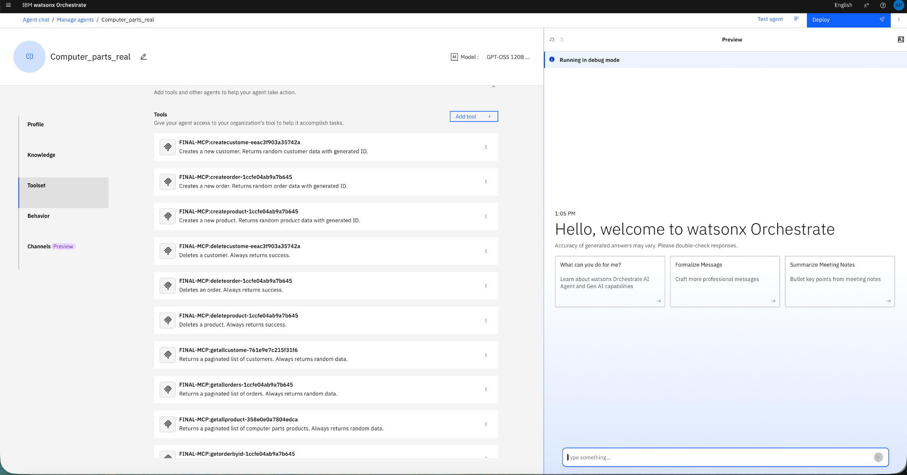
*Figure 2: Adding a new AI agent*

### 3. Connecting an MCP Server

After you click create new agent, you will be brought to a configuration page. Do **Create from scratch → Create**. You will then be brought to your named agent. In the **Profile** tab, scroll down and click **Add Tool**. Then, **MCP server → Add MCP server → Remote MCP Server → Next**. On this screen, you will enter the name and description, and paste the link of the MCP server that we got at the end of Section 2. This is how Watsonx will access your MCP server. After that, add all of the functions you want (recommended: all of them), then create your agent.

This step is what connects your agent to the real-world API. You will provide the Gateway Endpoint URL from Section 2, which tells the agent where to find the MCP tools.

Follow these steps:

1. In your agent's **Profile** tab, scroll down and click **Add Tool**.
2. Select **MCP Server → Add MCP Server → Remote MCP Server → Next**.
3. Enter a name and description for the server (e.g., "Computer Parts API" and "Provides tools for managing computer parts store data").
4. Paste the Gateway Endpoint URL from Section 2 into the **Server URL** field.
5. Click **Next**. Watsonx will connect to the server and retrieve the list of available tools.
6. Select all available tools (recommended), then click **Add**.
7. Click **Save** to save your agent configuration.

Your agent now has access to every tool your MCP server exposes — meaning it can retrieve customers, look up orders, browse products, and more, all through natural language.

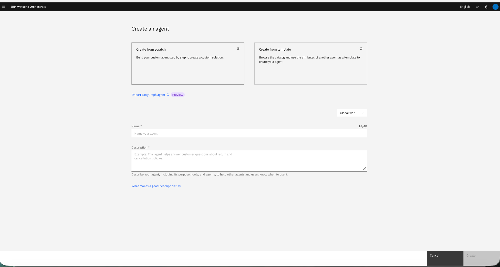
*Figure 3: Connecting MCP Server to WatsonX*

### 4. Testing

With everything connected, test your agent to confirm the full system is working end to end.

In the Preview panel on the right side of the agent builder, try typing a natural language request such as: *"Show me customer details."* The agent should interpret the request, call the correct MCP tool, retrieve data from the OpenShift API through DataPower, and return a formatted response.

The example output below shows the agent returning a structured breakdown of available customer-related functions. This is exactly the kind of intelligent, context-aware behavior you would expect from an AI system.

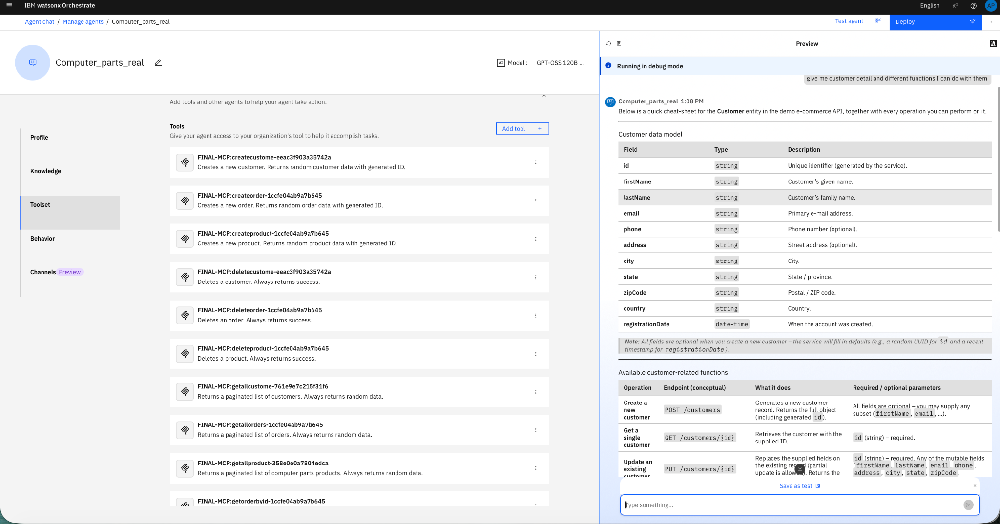
*Figure 4: Example Agent Output. The Full System Working End to End*

### Section 3 Complete

Watsonx Orchestrate is now connected to your MCP server and, through it, to your OpenShift API. The agent can translate natural language into real API calls and return meaningful results — all without the user ever needing to know what an API endpoint looks like.

---

## Section 4 — Deploying and Connecting UI

In this section, the final user-facing layer of the system is implemented by deploying a chatbot UI and connecting it to the Watsonx Orchestrate agent.

The objective is to enable users to interact with the system through a web interface where natural language input is securely sent to the AI agent and processed through the backend architecture.

### 1. Install Required Tools

Before we start, we need to have the correct tools installed. In the terminal of your local device, first install Homebrew:

```bash
/bin/bash -c "$(curl -fsSL https://raw.githubusercontent.com/Homebrew/install/HEAD/install.sh)"
```

Next, install the OpenShift CLI:

```bash
brew install openshift-cli
```

Next, verify proper installation:

```bash
oc version
kubectl version
```

### 2. Log in to OpenShift Cluster

With all of those steps done, the proper prerequisite tools should be installed. Now, in the OpenShift UI, navigate to **? → Command Line Tools → Copy Login Command → Display Token**. You should see a box under "Log in with this token." In your terminal, run:

```bash
oc login --token=YOUR_TOKEN --server=https://api...
```

Then verify the connection:

```bash
kubectl get nodes
```

You will now be logged in to the OpenShift cluster on your local device.

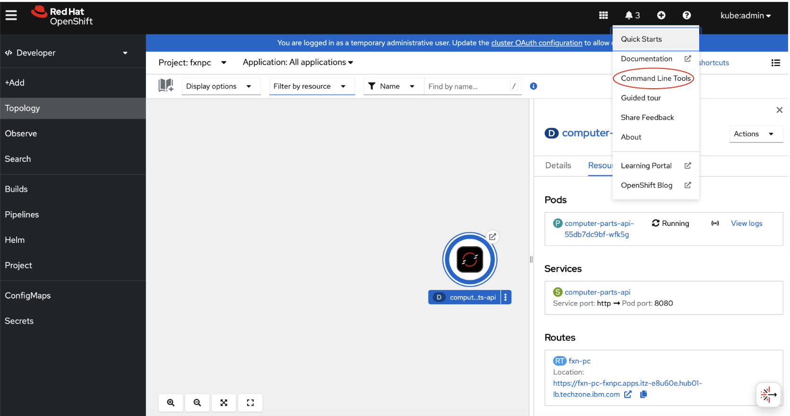
*Figure 1: Logging in to OpenShift*

### 3. Clone and Navigate to UI Project

In order to copy the project to your local machine, run the following commands in your terminal:

```bash
git clone https://github.com/fxnaranjo/fxnpcui
cd computer_parts/fxnpcui
npm install
```

These steps create a local instance of the project and install the correct project dependencies.

### 4. Generate Authentication Keys

The UI uses JWT authentication to securely connect to Watsonx. First, generate a private and public key pair:

```bash
openssl genrsa -out jwtRS256.key 2048
openssl rsa -in jwtRS256.key -pubout -out ibmPublic.key.pub
```

Next, verify the formats of the keys — they must have a beginning and ending line:

```bash
cat jwtRS256.key
cat ibmPublic.key.pub
```

From these commands, you should be able to see your personal authentication keys.

### 5. Configure Embedded Security in WatsonX

We need to make sure that Watsonx actually wants to connect to our website. In Watsonx Orchestrate, navigate to **Settings → Embed Security**. Under **public key**, copy and paste the entire PUBLIC key that you just generated, making sure to include the `BEGIN PUBLIC KEY` and `END PUBLIC KEY` lines. Also make sure that security is enabled. Then save the configuration if it doesn't automatically save. This step allows Watsonx to trust tokens generated by the UI.

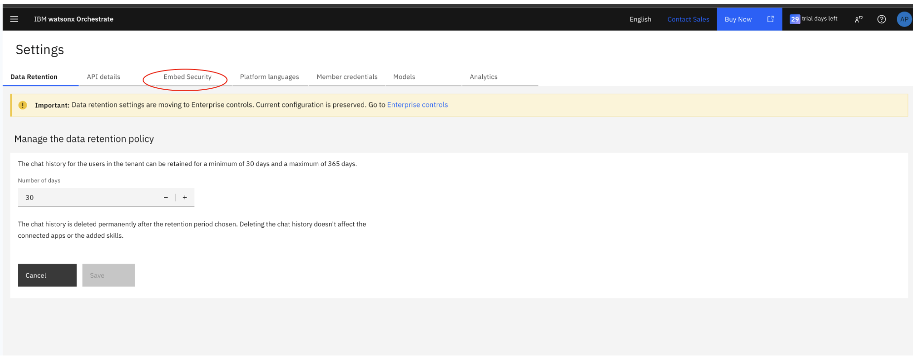
*Figure 2: Embedding Security*

### 6. Retrieve Embedded Agent Configuration

In Watsonx Orchestrate, navigate to **Agent → Channels → Embedded Agent → Live**. In this area, you will see your orchestrationID, hostURL, agentID, and environmentID. You will need all of these values. Once you find them, run the following commands on separate lines in your terminal. **Make sure you fill in the correct values here.**

```bash
export WXO_ORCHESTRATION_ID="..."
export WXO_HOST_URL="https://us-south.watson-orchestrate.cloud.ibm.com"
export WXO_AGENT_ID="..."
export WXO_AGENT_ENVIRONMENT_ID="..."
```

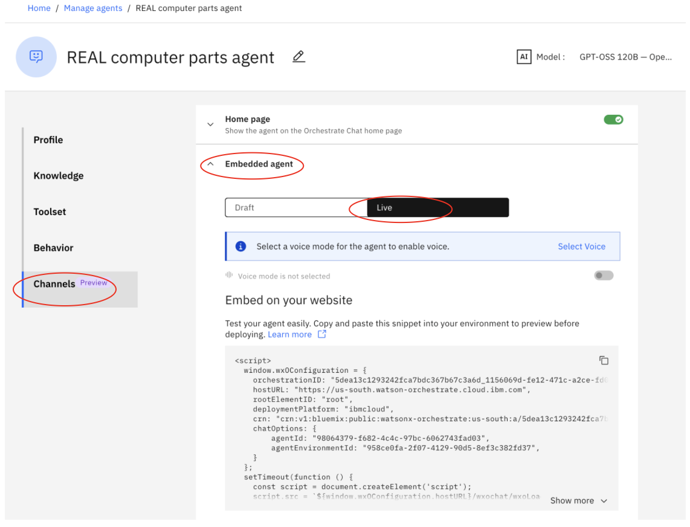
*Figure 2: Creating Agents*

### 7. Preparing Project Key Directory / Creating Kubernetes Secret

Now that we have the correct environment imported, we can move forward with the project. Run the following commands to prepare/create a project key directory. This is where the information for your keys will be held.

```bash
mkdir -p keys
cp jwtRS256.key keys/
cp ibmPublic.key.pub keys/
ls keys
```

The last line verifies that `keys` has data stored inside it. Now that we have done this, we can create a Kubernetes secret. We need to inject keys and config into the cluster so that we are able to view it in OpenShift.

```bash
kubectl delete secret chatbot-secrets -n chatbot-app
./scripts/create-k8s-secret.sh
```

This makes the keys and environment variables both available inside of containers.

### 8. Deploy UI Application

We have now done the correct setup to deploy our actual application and chatbot.

```bash
npm run k8s:deploy
```

This creates the deployment, service, and routes. Then restart the pods and verify deployment:

```bash
kubectl rollout restart deployment chatbot-deployment -n chatbot-app
kubectl get pods -n chatbot-app
```

When you do this, you should see the status as "Running" for all of the pods. Now, get the URL:

```bash
oc get route -n chatbot-app
```

By running this command, you will be given a URL that you can copy and paste into your browser.

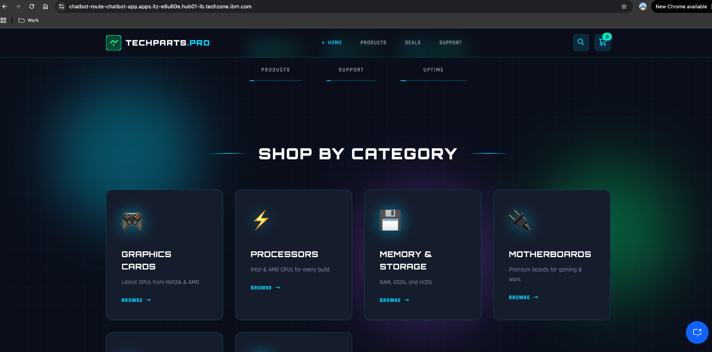
*Figure 4: Deploying the website*

### 9. Testing

We should now be able to test the application. You should be able to ask any question that Watsonx could handle and get results back. The expected behavior is that the chat initializes without errors, the UI connects to the Watsonx agent, user input is processed, and real backend data is returned.

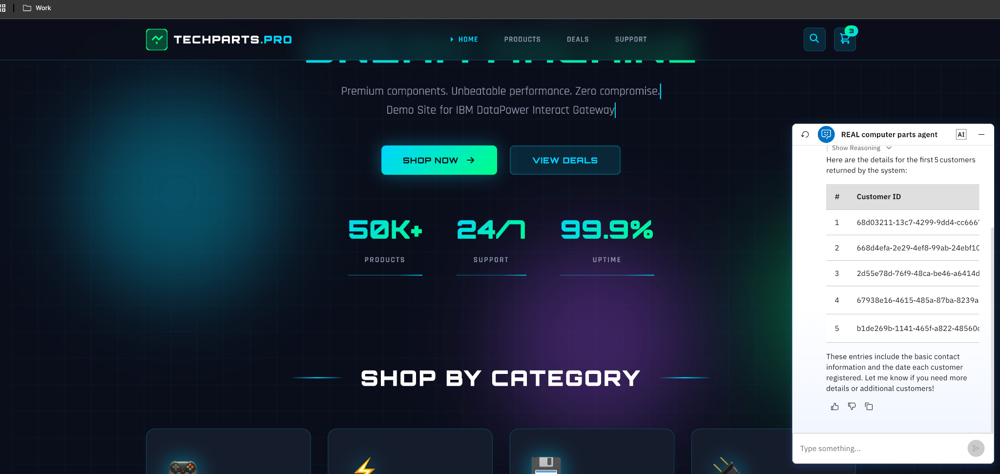
*Figure 5: Example Query*

### Section 4 Complete

In this section, the UI was successfully installed and deployed to OpenShift, configured with Watsonx agent details, secured using JWT authentication, and integrated into the full AI architecture. The system is now fully operational, allowing users to interact with enterprise APIs through a conversational AI interface.

---

## Real World Relevance

In real enterprise environments, organizations rely on multiple backend systems and APIs that are often difficult for non-technical users to access. This architecture shows how those systems can be transformed into an AI-driven interface using MCP and Watsonx Orchestrate, allowing users to interact with backend data through natural language instead of APIs.

By combining API Connect with Watsonx, businesses can build a secure and scalable middle layer that exposes internal services while enabling intelligent orchestration. This allows teams like customer support, operations, and business stakeholders to quickly access real-time data without needing technical expertise.

Overall, this approach shifts from traditional API-centric systems to AI-driven platforms, improving accessibility, productivity, and enabling future automation and decision-making across the organization.
